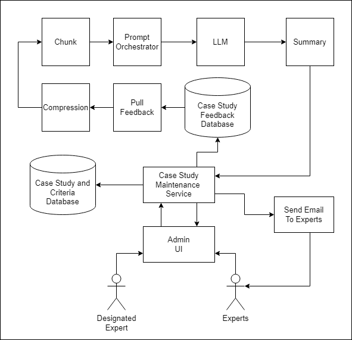
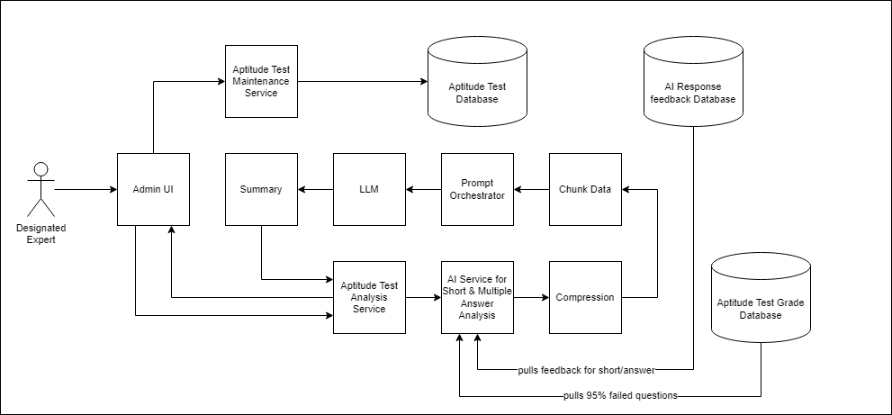
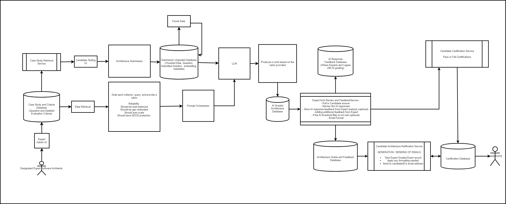
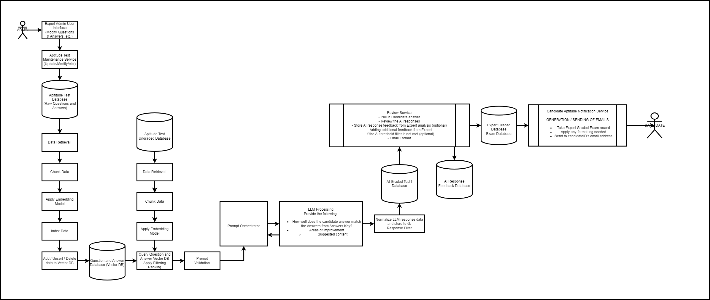
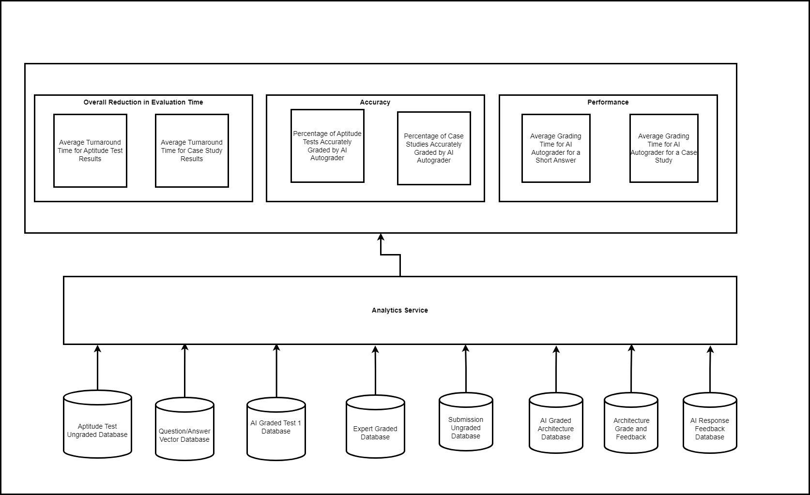

# Skynet AI | O'Reilly Kata: Architecture & AI (Winter 2025)

   

---

## **Table of Contents**

- [Skynet AI | O'Reilly Kata: Architecture \& AI (Winter 2025)](#skynet-ai--oreilly-kata-architecture--ai-winter-2025)
  - [**Table of Contents**](#table-of-contents)
  - [Overview](#overview)
    - [About the project](#about-the-project)
    - [Team Members](#team-members)
    - [Deliverables](#deliverables)
    - [Judges' Criteria](#judges-criteria)
  - [About Certifiable, Inc](#about-certifiable-inc)
    - [Certification Process](#certification-process)
  - [Requirements](#requirements)
    - [Functional Requirements](#functional-requirements)
      - [AI Grading for Certification Tests (Aptitude Test)](#ai-grading-for-certification-tests-aptitude-test)
      - [AI-Driven Analysis and Recommendations (Email The Results)](#ai-driven-analysis-and-recommendations-email-the-results)
      - [AI Grading Confidence and Automation (Short Answer Review and Case Study Solution)](#ai-grading-confidence-and-automation-short-answer-review-and-case-study-solution)
      - [AI Review and Feedback on Test Reports (Admin - Aptitude Test Analysis Report)](#ai-review-and-feedback-on-test-reports-admin---aptitude-test-analysis-report)
      - [AI Observability](#ai-observability)
      - [Feedback for New Case Studies/Aptitude tests](#feedback-for-new-case-studiesaptitude-tests)
    - [Non-Functional Requirements](#non-functional-requirements)
    - [Assumptions and Constraints](#assumptions-and-constraints)
  - [Architecture and Design](#architecture-and-design)
    - [Current Architecture](#current-architecture)
      - [Admin](#admin)
      - [Certification](#certification)
        - [Case Study](#case-study)
        - [Aptitude](#aptitude)
    - [Future Architecture](#future-architecture)
      - [AI Admin Case Studies feedback](#ai-admin-case-studies-feedback)
      - [AI Admin Expert Refinement of Aptitude Test](#ai-admin-expert-refinement-of-aptitude-test)
      - [AI Case Study Grader Description](#ai-case-study-grader-description)
        - [Candidate Submission:](#candidate-submission)
        - [Retrieval and Chunking:](#retrieval-and-chunking)
        - [Embedding and Storage:](#embedding-and-storage)
        - [Criteria Retrieval:](#criteria-retrieval)
        - [AI Processing:](#ai-processing)
        - [Expert Review:](#expert-review)
        - [Final Grading and Notification:](#final-grading-and-notification)
      - [AI Short Answer Grader Description](#ai-short-answer-grader-description)
        - [1. Data Preparation:](#1-data-preparation)
        - [2. Storage:](#2-storage)
        - [3. Query Processing:](#3-query-processing)
        - [4. Grading:](#4-grading)
        - [5. Feedback:](#5-feedback)
        - [6. Candidate Notification:](#6-candidate-notification)
      - [Observability Dashboard](#observability-dashboard)
  - [Dashboard Metrics](#dashboard-metrics)
    - [Overall Reduction in Evaluation Time](#overall-reduction-in-evaluation-time)
    - [Accuracy](#accuracy)
    - [Performance](#performance)
  - [Analytics Service Functions](#analytics-service-functions)
    - [Connected Databases](#connected-databases)
    - [Architecture Decision Records](#architecture-decision-records)

## Overview

### About the project

The purpose of this GitHub repository is to explore and identify opportunities for the use of Generative AI within Certifiable Inc.'s existing certification system. The goal is to redesign the architecture to support AI-driven enhancements that can manage the increased demand for software architecture certifications.

### Team Members

- Brandon Moriarty
- Chris Acton
- Jagreet Atwal
- Megin Mathew
- Ryan Hertzog

### Deliverables

The following deliverables will be provided:

- **Overview**: A narrative describing how AI is used in the certification system.
- **Diagrams**: Comprehensive views for each use of AI.
- **ADRs**: Architectural Decision Records for AI implementations, including trade-off analysis.
- **Implementation Details**: Pertinent implementation details (optional).
- **Video**: A five-minute video describing the team's approach (for semi-final teams).

### Judges' Criteria

The solutions will be evaluated based on:

- Innovative use of Generative AI.
- Suitability of the solution given the constraints.
- Appropriate levels of detail.
- Use of AI architecture patterns.
- Avoidance of AI architecture anti-patterns.
- Validation and verification of AI results.

## About Certifiable, Inc

Certifiable Inc. is a leading company in software architecture certification, based in the United States. The company provides accredited certification to qualified software architects through its flagship system, SoftArchCert. With the recent acceptance of software architecture certification in Europe, the U.K., and Asia, Certifiable Inc. is anticipating a significant increase in certification requests. This repository aims to explore opportunities to introduce AI to their current certification process to handle the expected growth efficiently.

### Certification Process

Certifiable Inc.'s certification process involves two main tests:

1. **Aptitude Test**: This test includes multiple-choice and short-answer questions. Multiple-choice questions are auto-graded, while short-answer questions are graded manually by expert software architects.
2. **Architecture Submission**: Candidates must create an architecture for a randomly assigned case study. The submissions are reviewed and graded by expert software architects.

## Requirements

### Functional Requirements

#### AI Grading for Certification Tests (Aptitude Test)

- Implement AI to grade short answer questions based on an answer key.
- Provide candidates with an option to grade questions they are presented with for certification.

#### AI-Driven Analysis and Recommendations (Email The Results)

- Create a breakdown/analysis of test results using AI.

#### AI Grading Confidence and Automation (Short Answer Review and Case Study Solution)

- Implement AI grading with a confidence level value.
- Allow for quick expert review of AI-graded results based on confidence levels.
- Enable fully automated grading for high-confidence results, setting a threshold for automation.

#### AI Review and Feedback on Test Reports (Admin - Aptitude Test Analysis Report)

- Use AI to review test reports and provide summaries with feedback on question relevance.
- Analyze both multiple-choice and short answer questions.

#### AI Observability

- Implement observability features to provide details on AI review accuracy, test evaluation time and AI grading performance. (Auditing AI reviews)
- Make adjustments based on observations and feed them back into the model for continuous training. (Feed it back to vector DB)
- Build observability features to monitor AI cost, and time reduction/improvements. (Dashboard for AI cost and Insights into ROI based on AI usage)
- Analyze reviews which have a conflict between AI review and expert reviews and provide suggestions.

#### Feedback for New Case Studies/Aptitude tests

- Gather feedback on expert accuracy from analyzed aptitude test reports and have AI analyze the feedback and provide summary.
- Allow designated experts to send out surveys to other experts for feedback on new case studies.
- Use AI to review and summarize the feedback, aiding in the creation and modification of case studies.

### Non-Functional Requirements

- **Scalability**: The system should be able to handle increase in certification requests.
- **Reliability**: The system should be reliable and accurate in grading certification tests.
- **Performance**: The system should provide timely feedback to candidates.
- **Maintainability**: The system should be easy to maintain and update.
- **Security**: The system should ensure the privacy and security of candidate data.
- **Cost-Effectiveness**: The system should be cost-effective to operate and maintain.
- **Observability**: The system should provide observability features to monitor AI performance and cost.

### Assumptions and Constraints

Certifiable Inc. faces several challenges due to the anticipated increase in certification requests:

- Manual grading of short-answer questions and architecture submissions is time-consuming.
- Currently, Certifiable, Inc. has on average 200 candidates per week seeking certification across the U.S.
- Candidate certifications are expected to grow 5-10X based on oversees expansion as well as the anticipated 21% growth over the next 4 years.
- The current system may not be able to handle the increased volume of certification requests.
- Ensuring the accuracy and reliability of the certification process is critical.
- No PII (Personnel identifiable information) data wil be passed to the AI model.
- Leverage existing technology (ex. Azure monitoring, AWS CloudWatch) to monitor AI performance and cost.

## Architecture and Design

### Current Architecture

#### Admin

   

#### Certification

##### Case Study

   

##### Aptitude

   

### Future Architecture

#### AI Admin Case Studies feedback

   

This diagram details the container-level architecture for handling feedback from experts on the case studies.  The Designated Expert uses the feedback to update the case studies.

1. **Chunk**: Breaks down data into manageable chunks for processing by Prompt Orchestrator and LLM.
2. **Prompt Orchestrator**: It organizes and manages prompts for the LLM. Takes the compressed case studies and asks for LLM to summarize the content.
3. **LLM**: The Large Language Model processes the prompts and generates outputs.
4. **Summary**: The output from the LLM is summarized.
5. **Case Study Feedback Database**: Stores feedback related to case studies.
6. **Compression**: Compresses data before storing it in the Case Study Feedback Database.
7. **Pull Feedback**: Retrieves feedback from the Case Study Feedback Database for further processing or analysis.
8. **Case Study and Criteria Database**: Stores case studies along with their criteria.
9. **Case Study Maintenance Service**: Manages updates and maintenance of case studies, interacting with both databases (Case Study Feedback Database and Case Study and Criteria Database).
10. **Admin UI (User Interface)**: Allows administrators to interact with the system.
11. **Designated Experts**: Individuals who create case studies and collect feedback from Experts.
12. **Experts**: Individuals who provide feedback on case studies.

#### AI Admin Expert Refinement of Aptitude Test

   

This diagram details the container-level architecture for handling AI grading errors and updating the Aptitude Test database.

1. **Designated Expert**: The process starts with input from a designated expert.
2. **Admin UI**: The expert interacts with the Admin UI, which serves as the interface for managing the system.
3. **Aptitude Test Maintenance Service**: This service maintains the aptitude tests and interacts with the Aptitude Test Database.
4. **Aptitude Test Database**: Stores data related to aptitude tests.
5. **Aptitude Test Grade Database**: Stores grades for aptitude tests.
6. **Aptitude Test Analysis Service**: This service provides analysis of Aptitude Tests.
7. **AI Service for Short & Multiple Answer Analysis**: Analyzes short answers and multiple-choice responses, feeding back into Aptitude Test Analysis Service or pulling feedback from AI Response Feedback Database.  Additionally pulls feedback from Aptitude Test Grade Database for questions and answers that were failed by 95% of candidates.
8. **Summary**: Summarized output from LLM on why the candidate answers were wrong for the question and answer provided as the context.
9. **LLM (Large Language Model)**: Processes information and provides language-based analysis or responses.
10. **Prompt Orchestrator**: Manages prompts for LLM. Provides to LLM the following context: Aptitude Test Question & Answer and the candidate's answer; and then asks LLM to provide feedback on what could be changed in the question and answer to help candidates' answers.
11. **Chunk Data**: Breaks down data into manageable chunks for processing by Prompt Orchestrator and LLM.
12. **AI Response Feedback Database**: Stores feedback pulled by Chunk Data to improve AI responses.
13. **Compression**: Compresses data before sending it to AI Service for Short & Multiple Answer Analysis.

#### AI Case Study Grader Description

   

The AI Case Study Grader solution creates a comprehensive and efficient process for grading case study submissions using AI, with expert review and feedback integrated into the workflow.

##### Candidate Submission:

- The candidate submits their architecture solution through the candidate UI.
- The submission is stored in the Submission Ungraded Database.

##### Retrieval and Chunking:

- The submitted data is retrieved from the ungraded database.
- The data is chunked to reduce the amount of data and improve processing efficiency.

##### Embedding and Storage:

- The chunked data is embedded and stored in a vector database for efficient searching and comparison.

##### Criteria Retrieval:

- The detailed evaluation criteria for the case study in the form of a rubric is retrieved from the Case Study and Criteria Database.

##### AI Processing:

- A a prompt orchestration layer will handle user queries and generate prompts for the LLM. The LLM will process the prompts and generate responses.
- The AI processes the candidate's submission by comparing it against the evaluation criteria in the form of a rubric and evaluates how well the submission meets the criteria and provides a detailed analysis.

##### Expert Review:

- If the AI's evaluation does not meet a certain accuracy threshold set in the evaluation criteria, the submission is sent for expert review.
- The expert reviews the AI's analysis and provides additional feedback if necessary.

##### Final Grading and Notification:

- The final graded submission is stored in the Architecture Grade and Feedback Database.
- Notifications are sent to the candidate regarding their results through the Candidate Architecture Notification Service, including summaries of the feedback data highlighting areas for improvement and providing insights into the overall performance of the candidate.
- Test results are also stored in the Certification Database and can be accessed through the Candidate Viewer UI.

#### AI Short Answer Grader Description

   

The AI Short Answer Grader solution leverages chunking, embedding, and vector databases to efficiently process and grade short answers, ensuring accurate and meaningful feedback for candidates.

##### 1. Data Preparation:

- **Chunking**: Large documents are split into smaller, manageable chunks to facilitate efficient processing and embedding. This involves specifying chunk sizes and overlaps to ensure meaningful segmentation.
- **Embedding**: Each chunk is converted into a high-dimensional vector using an embedding model, capturing the semantic meaning of the chunk. This process involves using models like BERT or GPT to generate embeddings.

##### 2. Storage:

- **Vector Database**: The embeddings and corresponding chunk data are stored in a vector database. This database is designed to handle high-dimensional vectors efficiently and supports fast similarity searches.
  - In this solution, the database is used to store both the raw data and the embeddings, allowing for efficient indexing and retrieval.

##### 3. Query Processing:

- **Embedding Candidate Answers**: When a candidate submits an answer, it is converted into an embedding using the same model used for the answer key. This ensures consistency in the representation of the data.
- **Similarity Search**: The candidate's embedding is compared against the stored embeddings in the vector database to find the most similar chunks. This involves using algorithms like cosine similarity to measure the closeness of the embeddings.

##### 4. Grading:

- **Retrieval of Relevant Chunks**: The top N most similar chunks are retrieved from the vector database. These chunks represent the most relevant parts of the answer key that match the candidate's answer.
- **LLM Evaluation**: The retrieved chunks, along with the candidate's answer and the original question, are passed to a large language model (LLM) for evaluation. The LLM assesses the similarity and provides a grade, along with feedback if necessary.

##### 5. Feedback:

- **Meaningful Feedback**: The LLM provides detailed feedback on the candidate's answer, highlighting areas of improvement or confirming correctness. This feedback is based on the comparison of the candidate's answer with the retrieved chunks from the answer key. The feedback is personalized for each candidate, including their answer, what parts of the answer were correct or incorrect, and potential areas of improvement. This ensures that the feedback is relevant and meaningful to the candidate.
- **Feedback Review**: The expert software architects will access the feedback data, which includes the candidate's answer, the relevant chunks from the answer key, and the LLM's evaluation and feedback. They will analyze the feedback to understand the LLM's assessment. They will look at the specific points highlighted by the LLM, such as areas where the candidate's answer was correct or needed improvement, then validate the LLM's feedback by cross-referencing it with the answer key and their own knowledge. They will ensure that the feedback is accurate and aligns with the grading criteria.

##### 6. Candidate Notification:

- **Formatting**: The feedback is formatted in a clear and understandable manner, making it easy for the candidate to comprehend the evaluation and areas of improvement.
- **Timely Delivery**: The feedback is delivered in a timely manner, ensuring that candidates receive it promptly after the expert review process.

#### Observability Dashboard

   

The Observability Dashboard helps review AI accuracy, performance, and the overall reduction in time taken to evaluate certification exams.

## Dashboard Metrics

### Overall Reduction in Evaluation Time

- **Average Turnaround Time for Aptitude Test Results:** Measures the average time taken to grade and return results for the aptitude test, which includes multiple-choice questions and short answers. This metric tracks the duration from when the candidate submits their exam to when the final grades are recorded in the database.
- **Average Turnaround Time for Case Study Results:** Measures the average time taken to grade and return results for the architecture case studies.This metric tracks the duration from when the candidate submits their architecture for the case study to when the final grades and feedback are recorded in the database.

### Accuracy
- **Percentage of Aptitude Tests Accurately Graded by AI Autograder:** Indicates the percentage of Aptitude Tests(short answers) accurately graded by the AI auto grader without requiring any corrections from the expert reviewer. 
- **Percentage of Case Studies Accurately Graded by AI Autograder:** Indicates the percentage of case study architectures accurately graded by the AI auto grader without requiring any corrections from the expert reviewer. 

### Performance
- **Average Grading Time for AI Autograder for a Short Answer:** Measures the average time taken by the AI Autograder to grade an individual short answer.
- **Average Grading Time for AI Autograder for a Case Study:** Measures the average time taken by the AI Autograder to grade a case study.

## Analytics Service Functions
- **Data Collection and Storage:** Connects to various databases to collect and store data related to aptitude tests, case studies, and feedback.
- **Data Analysis:** Analyzes the collected data to generate insights on AI accuracy, performance, and evaluation time.
- **Performance Monitoring:** Monitors key metrics such as average turnaround time, grading accuracy, and grading time for both aptitude tests and case studies.

### Connected Databases
The Analytics Service connects to the following databases:
1. **Aptitude Test Ungraded Database:** Stores ungraded aptitude test submissions.
2. **Question/Answer Vector Database:** Stores vector representations of questions and answers.
3. **AI Graded Test 1 Database:** Stores results of aptitude tests graded by the AI.
4. **Expert Graded Database:** Stores the exam grades after review by the SA experts(this is after the AI grades it).
5. **Submission Ungraded Database:** Stores ungraded case study submissions.
6. **AI Graded Architecture Database:** Stores results of architecture case studies graded by the AI.
7. **Architecture Grade and Feedback:** Stores the final grades and feedback for architecture case studies.
8. **AI Response Feedback Database:** Stores feedback on AI grading added by the expert reviewers and gives the data for the AI grades which were corrected by the experts.

### Architecture Decision Records

An Architecture Decision Record (ADR) is a document that captures an important architectural decision made along with its context and consequences. It helps teams keep track of the architectural history and rationale behind decisions, ensuring transparency and facilitating future maintenance and evolution of the system. The following template will be used for all ADRs; [ADR template](adr/000-adr-template.md)

- [001 - Create an index per question and version for short answer Vector DB](adr/001-create-index-per-question-and-version-for-short-answer-vector-db.md)
- [002 - Use Vector DB to store raw content and embeddings](adr/002-use-vector-database-to-store-raw-content-and-embeddings.md)
- [003 - Store candidate aptitude test submissions by question](adr/003-store-candidate-aptitude-test-submissions-by-question.md)
- [004 - Data will be chunked before storing](adr/004-data-will-be-chunked-before-storing.md)
- [005 - Apply embeddings model before storing to Vector DB](adr/005-apply-embeddings-model-before-storing-to-vector-database.md)
- [006 - Version Vector DB indexes and stored data](adr/006-version-vector-database-indexes-and-stored-data.md)
- [007 - Apply filtering to Vector DB results before sending to LLM](adr/007-apply-filtering-to-vector-db-results-before-sending-to-LLM.md)
- [008 - Validate prompts before sending information to LLM for processing](adr/008-validate-prompts-before-sending-information-to-LLM-for-processing.md)
- [009 - Implement prompt orchestrator to manage prompts](adr/009-implement-prompt-orchestrator-to-manage-prompts.md)
- [010 - LLM will evaluate and grade one question at a time](adr/010-LLM-will-evaluate-and-grade-one-question-at-a-time.md)
- [011 - Use prompt compression before LLM processing](adr/011-use-prompt-compression-before-LLM-processing.md)
- [012 - Storing AI graded exams as a single ready to review record](adr/012-storing-AI-graded-exams-as-a-single-ready-to-review-record.md)
- [013 - Allow expert graders to provide feedback for AI graded-exams](adr/013-allow-expert-graders-to-provide-feedback-for-AI-graded-exams.md)
- [014 - Store expert grader AI response feedback for tuning](adr/014-store-expert-grader-AI-response-feedback-for-tuning.md)
- [015 - Use grading criteria and rubric to evaluate and grade case study submissions](adr/015-use-grading-criteria-and-rubric-to-evaluate-and-grade-case-study-submissions.md)
- [016 - Dynamically create embeddings for case study submissions](adr/016-dynamically-create-embeddings-for-case-study-submissions.md)
- [017 - Enable admin review of captured feedback for AI and high error rate questions](adr/017-enable-admin-review-of-captured-feedback-for-AI-and-high-error-rate-questions.md)
- [018 - Gather and summarize feedback from certifiable experts for new exam questions](adr/018-gather-and-summarize-feedback-from-certifiable-experts-for-new-exam-questions.md)
- [019 - Use existing databases to measure observability metrics](adr/019-use-existing-databases-to-measure-observability-metrics.md)
- [020 - Build dashboard for SLO/SLA for AI services](adr/020-build-dashboard-for-SLO-SLA-for-AI-services.md)
- [021 - Monitor AI costs using vendor provided tools and dashboards](adr/021-monitor-AI-costs-using-vendor-provided-tools-and-dashboards.md)
