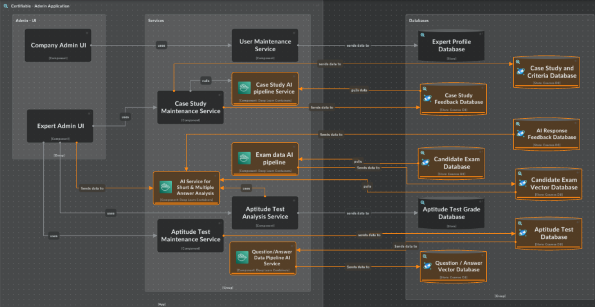

# System Overview

Please refer to the [business case and requirements](requirements.md) for reason and need for this system.

## Executive Summary

1. **Problem and Actors**:
   - We identified four key actors in our solution: **Candiates**, **Expert Software Architect** , **Designated Expert Software Architect** and **Administrator**.
   - Our goal is to ensure that the current Certifiable Inc software can handle the increased demand for software architecture certifications as they expand to U.K., Europe and Asia, by leveraging AI to streamline the manual process they currently have in place to grade the exams.

2. **Architecture Characteristics**:

   - We prioritized **Performance** and **Accuracy** as our top concern.

    ##### Performance

    1. **Efficiency and Speed:** AI grading systems can process and evaluate submissions much faster than human graders. This efficiency is crucial for handling the anticipated increase in certification requests, ensuring that results are delivered promptly
    2. **Scalability:** AI systems can easily scale to handle large volumes of submissions without compromising on speed or quality. This scalability is essential for managing the expected 5-10X increase in demand
    3. **Reduced Workload:** By automating the grading process, AI reduces the workload on human experts, allowing them to focus on more complex and nuanced tasks that require human judgment

    ##### Accuracy
        
    1. **Consistency:** AI grading systems follow predefined rules and standards, ensuring consistent and objective evaluations. This consistency helps maintain high standards across all submissions
    2. **Error Reduction:** AI systems are less prone to fatigue and human error, which can lead to more accurate grading
    3. **Continuous Improvement:** AI systems can learn and improve over time by incorporating feedback from expert reviewers, leading to increasingly accurate evaluations

3. **New AI System Components**:

     1. AI Short Answer Auto Grader
     2. AI Case Study Auto Grader
     3. AI Response Feedback Service
     4. Case Study AI Pipeline Service
     5. Exam Data AI Pipeline
     6. AI Service for Short and Miltiple Answer Analysis
     7. Question/Answer Data Pipeline AI Service

4. **Comprehensive Diagrams**

    Icepanel : https://s.icepanel.io/7x0vWrdHnLch4R/yBIc

   ### Admin Application

   

   ### Certification Application

   

